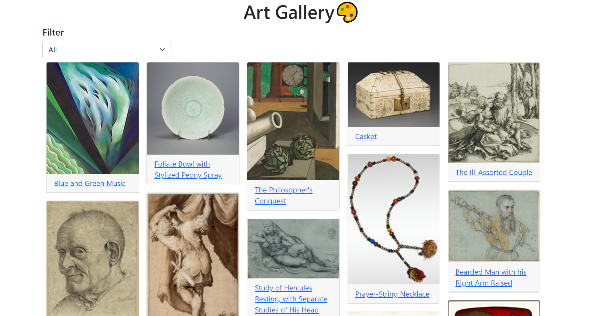
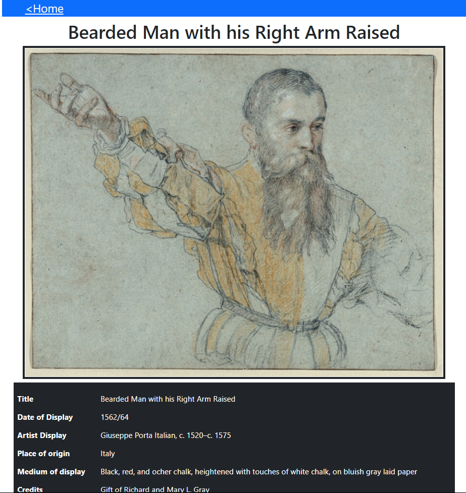

# Art Gallery, Catalogue of Art

An art gallery made with react and redux. You can filter components by category
which are dynamically populated from api. Like an a particular one ? click on 
it to see its full details and even share with friends.

## Libraries used

- redux
- react-router-dom
- bootstrap
- react-masonry-component

## Live demo

[Click here](https://keen-swanson-e32c5e.netlify.app/)

## Getting Started

- Clone the repo `https://github.com/iam-Akshat/react-art-gallery.git`
- `cd` into the project
- Run `npm install` to install all the dependencies
- Run `npm start`

## Deployment
 This is uploaded on Netlify. Check out Netlify for how to deploy your own version.

## Testing
Uses default create-react-app testing libraries
- redux-mock-store for mocking store
- history when testing react-router-dom related functionalities

## Authors

👤 **Akshat Sethi**

- Github: [iam-Akshat](https://github.com/iam-Akshat)
- Twitter: [Akshat Sethi](https://twitter.com/akshatsethi)
- LinkedIn: [Akshat Sethi](https://linkedin.com/in/akshatsethi)

## Contributing

- Fork the project
- Create your feature branch `git checkout -b awesome-feature`
- Commit your changes `git commit -m 'Awesome feature'`
- Push it `git push -u origin awesome-feature`
- Open a pull request using this branch

## Acknowledgements
- API by [Art Institute of Chicago](https://api.artic.edu/)
## Show your support

Give a ⭐️ if you like this project!
